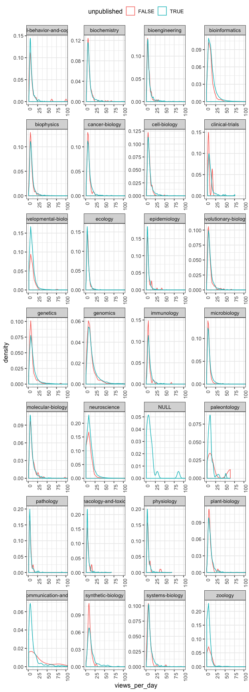

bioRxiv preprint stats
================
Hao Ye
2019-09-05

# Setup

``` r
library(tidyverse)
```

    ## ── Attaching packages ─────────────────────────────────────────── tidyverse 1.2.1 ──

    ## ✔ ggplot2 3.2.1     ✔ purrr   0.3.2
    ## ✔ tibble  2.1.3     ✔ dplyr   0.8.3
    ## ✔ tidyr   0.8.3     ✔ stringr 1.4.0
    ## ✔ readr   1.3.1     ✔ forcats 0.4.0

    ## ── Conflicts ────────────────────────────────────────────── tidyverse_conflicts() ──
    ## ✖ dplyr::filter() masks stats::filter()
    ## ✖ dplyr::lag()    masks stats::lag()

# Data Overview

See the `compute_paper_stats.R` file for the code used to generate the
paper stats data.

The data collects information on preprints, with one row per preprint.
Stats are computed by summing up monthly views and downloads for up to
the first 3 months after posting date (posted\_date + 3 months \>=
traffic\_date \>= posted\_date). Traffic stats are collected monthly, so
we assign a date equal to the last day of the month for the traffic.

Columns are:

  - `id` - unique numerical id for the preprint
  - `downloads` - number of pdf downloads
  - `views` - number of views of the abstract
  - `traffic_date` - latest traffic date for the summed views and
    downloads
  - `posted_date` - date of initial posting to bioRxiv
  - `collection` - the subject area designation on bioRxiv
  - `duration` - the \# of days, computed as traffic\_date -
    posted\_date + 1
  - `downloads_per_day` - downloads / duration
  - `views_per_day` - views / duration
  - `pub_date` - date of publication of preprint (NA if not yet
    published)

<!-- end list -->

``` r
paper_stats <- readRDS("paper_stats.RDS")
str(paper_stats)
```

    ## Classes 'tbl_df', 'tbl' and 'data.frame':    56060 obs. of  10 variables:
    ##  $ id               : num  386 387 388 389 390 391 392 393 394 395 ...
    ##  $ downloads        : num  142 102 100 447 34 39 66 86 187 81 ...
    ##  $ views            : num  1065 520 504 1236 337 ...
    ##  $ traffic_date     : Date, format: "2018-07-31" "2018-10-31" ...
    ##  $ posted_date      : Date, format: "2018-05-21" "2018-08-03" ...
    ##  $ collection       : chr  "microbiology" "microbiology" "microbiology" "microbiology" ...
    ##  $ duration         : num  72 90 90 93 90 90 90 90 90 91 ...
    ##  $ downloads_per_day: num  1.972 1.133 1.111 4.806 0.378 ...
    ##  $ views_per_day    : num  14.79 5.78 5.6 13.29 3.74 ...
    ##  $ pub_date         : Date, format: "2019-01-04" "2019-01-29" ...

## Filter papers

We want to focus on “low-visibility” preprints, so use only the papers
that are unpublished or published after the last date of traffic
collection (posted date + 3 months).

``` r
paper_stats <- paper_stats %>%
    mutate(unpublished = is.na(pub_date) | 
               pub_date > traffic_date)
```

## Examine statistical quantiles of views per day

Compute quantiles:

``` r
quantile_vec <- c(0.05, 0.1, 0.25, 0.5, 0.75, 0.9, 0.95)

views_quantiles <- paper_stats %>%
    filter(unpublished) %>%
    select(collection, views_per_day, downloads_per_day) %>%
    nest(-collection) %>%
    mutate(views_q = map(data, ~ quantile(.$views_per_day, probs = quantile_vec)), 
           views_q = map(views_q, ~ bind_rows(.) %>% gather())) %>%
    select(-data) %>% 
    unnest() %>%
    mutate(key = factor(key, levels = c("5%", "10%", "25%", "50%", "75%", "90%", "95%"))) %>%
    spread(key, value)

knitr::kable(views_quantiles)
```

| collection                             |       5% |      10% |      25% |       50% |       75% |      90% |      95% |
| :------------------------------------- | -------: | -------: | -------: | --------: | --------: | -------: | -------: |
| animal-behavior-and-cognition          | 3.659956 | 4.098578 | 5.109633 |  6.723077 | 10.144444 | 15.86632 | 20.32472 |
| biochemistry                           | 3.634848 | 4.355556 | 5.619383 |  7.739130 | 11.244444 | 17.57143 | 24.95576 |
| bioengineering                         | 2.871371 | 3.360342 | 4.476923 |  6.181818 |  9.748686 | 17.28893 | 26.93382 |
| bioinformatics                         | 4.375417 | 5.303664 | 7.220319 | 10.561910 | 16.699878 | 26.29810 | 35.50930 |
| biophysics                             | 3.584343 | 4.363636 | 5.644958 |  7.854839 | 11.294733 | 17.41772 | 24.72743 |
| cancer-biology                         | 3.382740 | 4.102465 | 5.380282 |  7.473106 | 11.143809 | 17.71127 | 23.20409 |
| cell-biology                           | 3.505562 | 4.112500 | 5.480379 |  7.666667 | 11.657239 | 18.76923 | 25.71091 |
| clinical-trials                        | 4.571548 | 4.906239 | 6.744136 |  8.873563 | 12.554486 | 17.85068 | 26.67536 |
| developmental-biology                  | 3.502465 | 4.297835 | 5.847222 |  7.962025 | 11.724138 | 17.66352 | 23.45082 |
| ecology                                | 2.394613 | 2.925329 | 3.895943 |  5.384168 |  8.100733 | 12.18857 | 15.77949 |
| epidemiology                           | 2.322565 | 2.723317 | 3.597170 |  4.894845 |  7.175446 | 11.47048 | 15.45469 |
| evolutionary-biology                   | 3.453079 | 4.212121 | 5.666667 |  8.173913 | 12.444272 | 19.60377 | 27.11551 |
| genetics                               | 3.727032 | 4.517102 | 6.357519 |  9.656470 | 15.657213 | 27.35199 | 41.62478 |
| genomics                               | 4.595370 | 5.582189 | 8.000000 | 12.476744 | 21.559524 | 37.78824 | 55.14722 |
| immunology                             | 3.801020 | 4.461326 | 5.723077 |  7.666667 | 11.616279 | 18.28019 | 25.58618 |
| microbiology                           | 2.918966 | 3.442377 | 4.574856 |  6.560976 | 10.258444 | 16.58691 | 22.74561 |
| molecular-biology                      | 3.255369 | 3.935508 | 5.199466 |  7.612903 | 12.171359 | 20.34815 | 28.45934 |
| neuroscience                           | 3.376471 | 4.120000 | 5.580247 |  8.000000 | 12.423224 | 19.25397 | 26.92897 |
| NULL                                   | 1.379310 | 1.602410 | 6.256410 |  8.484849 | 15.517857 | 30.10526 | 86.27273 |
| paleontology                           | 4.528357 | 4.808138 | 6.977011 | 10.285714 | 12.721519 | 18.32421 | 30.40724 |
| pathology                              | 2.612284 | 2.993182 | 3.647636 |  4.699631 |  6.695514 | 11.05046 | 15.73520 |
| pharmacology-and-toxicology            | 2.681746 | 3.151899 | 3.925926 |  4.943662 |  7.207317 | 10.91858 | 14.37532 |
| physiology                             | 2.305619 | 2.727273 | 3.404054 |  4.616377 |  6.923115 | 10.96394 | 14.20284 |
| plant-biology                          | 3.918788 | 4.814074 | 6.235294 |  8.869048 | 12.640625 | 18.71366 | 23.76184 |
| scientific-communication-and-education | 2.885185 | 3.559551 | 4.524390 |  7.729730 | 17.641975 | 48.30246 | 87.45330 |
| synthetic-biology                      | 4.857839 | 6.072276 | 8.103596 | 11.521164 | 18.361991 | 31.28075 | 46.76590 |
| systems-biology                        | 3.728750 | 4.713350 | 6.333333 |  8.554886 | 13.128507 | 20.64376 | 27.93924 |
| zoology                                | 2.900903 | 3.257258 | 4.137005 |  5.409350 |  7.438027 | 10.39593 | 13.66403 |

## Distributions of views per day

``` r
paper_stats %>%
    ggplot(aes(x = views_per_day, color = unpublished)) + 
    geom_density() + 
    coord_cartesian(xlim = c(0, 100)) + 
    facet_wrap(~collection, scales = "free", ncol = 4) + 
    theme_bw(base_size = 12) + 
    theme(axis.text.x = element_text(angle = 90, hjust = 1), 
          legend.position  = "top")
```

    ## Warning: Groups with fewer than two data points have been dropped.

<!-- -->

## How does recency of a preprint affect views

With more preprints being posted, we might expect the \# of views per
day to change with recency. For the least-visible preprints, the number
of views per day seems to be mostly constant. However, depending on
category, the upper-quantiles can vary, sometimes decreasing with
recency if sample sizes are small.

``` r
paper_stats %>%
    ggplot(aes(x = posted_date, y = views_per_day)) + 
    geom_point() + 
    geom_quantile(quantiles = quantile_vec, formula = "y ~ x") + 
    facet_wrap(~collection, scales = "free", ncol = 4) + 
    theme_bw(base_size = 12)
```

<!-- -->

## How does traffic decrease over time for a sample of preprints

``` r
db <- readRDS("raw_stats.RDS")

set.seed(42)
selected_ids <- sample(db$id, 50)

db %>%
    filter(id %in% selected_ids) %>%
    mutate(id = factor(id)) %>%
    group_by(id) %>%
    ggplot(aes(x = traffic_date - posted, y = views, color = id)) + 
    geom_line() + 
    theme_bw(base_size = 20) + 
    guides(color = "none")
```

    ## Don't know how to automatically pick scale for object of type difftime. Defaulting to continuous.

<!-- -->

# Compute an “Invisibility” index

Compute index as fraction of preprints in the same collection with at
least as many views\_per\_day.

``` r
paper_indices <- paper_stats %>%
    group_by(collection) %>%
    mutate(index = rank(views_per_day, ties.method = "min"), 
           index = 1 - index / n()) %>%
    ungroup() %>%
    select(id, collection, views_per_day, index, 
           traffic_date, posted_date, pub_date, 
           views, downloads)
```

## Select a few papers per collection to display

``` r
title_lookup <- db %>%
    select(id, title) %>%
    distinct()

selected_papers <- paper_indices %>%
    group_by(collection) %>%
    top_n(10, index) %>%
    arrange(collection, desc(index)) %>%
    left_join(title_lookup, by = "id") %>%
    select(collection, index, views_per_day, posted_date, title)

knitr::kable(selected_papers)
```

| collection                             |     index | views\_per\_day | posted\_date | title                                                                                                                                                                                                          |
| :------------------------------------- | --------: | --------------: | :----------- | :------------------------------------------------------------------------------------------------------------------------------------------------------------------------------------------------------------- |
| animal-behavior-and-cognition          | 0.9988399 |       1.8307692 | 2014-08-28   | Amino acid and carbohydrate tradeoffs by honey bee nectar foragers and their implications for plant-pollinator interactions                                                                                    |
| animal-behavior-and-cognition          | 0.9976798 |       1.8767123 | 2017-07-20   | Pitch discrimination performance of ferrets and humans on a go/no-go task.                                                                                                                                     |
| animal-behavior-and-cognition          | 0.9965197 |       1.9310345 | 2014-08-06   | Ontogeny of aerial righting and wing flapping in juvenile birds                                                                                                                                                |
| animal-behavior-and-cognition          | 0.9953596 |       2.1451613 | 2018-02-28   | Ontogeny of familiarity with foraging landscape and foraging abilities in the tropical social wasp Ropalidia marginata                                                                                         |
| animal-behavior-and-cognition          | 0.9941995 |       2.3409091 | 2018-12-03   | Adaptations in the echolocation behavior of fruit-eating bats when orienting under challenging conditions                                                                                                      |
| animal-behavior-and-cognition          | 0.9930394 |       2.4347826 | 2017-06-01   | Recency Order Judgments In Short Term Memory: Replication And Extension Of Hacker (1980)                                                                                                                       |
| animal-behavior-and-cognition          | 0.9918794 |       2.4615385 | 2018-08-02   | Brood-holding causes workers to pay attention to the queen in the carpenter ant Camponotus japonicus                                                                                                           |
| animal-behavior-and-cognition          | 0.9907193 |       2.4642857 | 2014-09-08   | SPOILS OF WAR AND PEACE: ENEMY ADOPTION AND QUEEN-RIGHT COLONY FUSION FOLLOW COSTLY INTRASPECIFIC CONFLICT IN ACACIA ANTS                                                                                      |
| animal-behavior-and-cognition          | 0.9895592 |       2.4725275 | 2018-05-02   | Dynamic gait transition in the Scolopendromorpha scolopocryptops rubiginosus L. Koch centipede                                                                                                                 |
| animal-behavior-and-cognition          | 0.9883991 |       2.5432099 | 2014-08-12   | A quantitative analysis of objective feather colour assessment: measurements in the lab are more reliable than in the field                                                                                    |
| biochemistry                           | 0.9993777 |       1.8804348 | 2018-10-01   | Crystal structure of a Thermus aquaticus diversity-generating retroelement variable protein                                                                                                                    |
| biochemistry                           | 0.9987554 |       2.0138889 | 2017-11-21   | Fe2+/H2O2-mediated oxidation of homogentisic acid indicates the production of ochronotic and non-ochronotic pigments. Implications in Alkaptonuria and beyond.                                                 |
| biochemistry                           | 0.9981332 |       2.0337079 | 2019-02-01   | Effect of flow rate and freezing on cyanocobalamin recovery using a commercial solid phase extraction cartridge.                                                                                               |
| biochemistry                           | 0.9975109 |       2.1449275 | 2014-01-22   | Correcting a SHAPE-directed RNA structure by a mutate-map-rescue approach                                                                                                                                      |
| biochemistry                           | 0.9968886 |       2.1451613 | 2019-07-01   | Characterization of Sorbitol Dehydrogenase SmoS from Sinorhizobium meliloti 1021                                                                                                                               |
| biochemistry                           | 0.9962663 |       2.2839506 | 2018-01-10   | 216 GHz Electron Paramagnetic Resonance of Mycobacterium Tuberculosis Catalase-Peroxidase: The Role of the Arg418 Residue                                                                                      |
| biochemistry                           | 0.9956441 |       2.3417722 | 2015-02-11   | The experimental determination of redox-potential of mutated cytochrome c with eight charge changing substitutions                                                                                             |
| biochemistry                           | 0.9950218 |       2.3595506 | 2018-01-02   | Biochemical analyses reveal amino acid residues critical for cell cycle-dependent phosphorylation of human Cdc14A phosphatase by cyclin-dependent kinase 1                                                     |
| biochemistry                           | 0.9943995 |       2.3707865 | 2019-02-01   | Development of Triazoles based on AZT and their Anti-Viral Activity Against HIV-1                                                                                                                              |
| biochemistry                           | 0.9937772 |       2.4285714 | 2018-10-02   | Structural and biochemical characterization on the cognate and heterologous interactions of the MazEF-mt9 TA system                                                                                            |
| bioengineering                         | 0.9990689 |       1.0967742 | 2019-07-01   | STATIC LOADING OF THE KNEE JOINT RESULTS IN MODIFIED SINGLE LEG LANDING BIOMECHANICS                                                                                                                           |
| bioengineering                         | 0.9981378 |       1.4302326 | 2015-07-07   | Automated segmentation of skin strata in reflectance confocal microscopy depth stacks                                                                                                                          |
| bioengineering                         | 0.9972067 |       1.5978261 | 2019-03-01   | Deconvolving multiplexed protease signatures with substrate reduction and activity clustering                                                                                                                  |
| bioengineering                         | 0.9962756 |       1.6195652 | 2019-05-01   | Targeting Fe3O4 Au nanoparticles in photoacoustic nuclear magnetic dual-mode imaging                                                                                                                           |
| bioengineering                         | 0.9953445 |       1.6521739 | 2018-11-01   | Osmotic Swelling Responses are Conserved Across Cartilaginous Tissues with Varied Sulfated-Glycosaminoglycan Contents                                                                                          |
| bioengineering                         | 0.9944134 |       1.7173913 | 2018-11-01   | Structural and Practical Identifiability of Dual-input Kinetic Modeling in Dynamic PET of Liver Inflammation                                                                                                   |
| bioengineering                         | 0.9934823 |       1.9850746 | 2018-11-26   | Thermopneumatic suction integrated microfluidic blood analysis system                                                                                                                                          |
| bioengineering                         | 0.9925512 |       2.0161290 | 2019-07-01   | Tissue-specific changes in size and shape of the ligaments and tendons of the porcine knee during post-natal growth                                                                                            |
| bioengineering                         | 0.9916201 |       2.0326087 | 2019-03-01   | Molecular Phenotyping of Oxidative Stress in Diabetes Mellitus with Point-of-care NMR system                                                                                                                   |
| bioengineering                         | 0.9906890 |       2.0869565 | 2019-03-01   | The Microbial Metagenome and Tissue Composition in Mice with Microbiome-Induced Reductions in Bone Strength                                                                                                    |
| bioinformatics                         | 0.9998257 |       0.7179487 | 2013-11-15   | Gappy TotalReCaller for RNASeq Base-Calling and Mapping                                                                                                                                                        |
| bioinformatics                         | 0.9996514 |       0.7948718 | 2013-11-15   | Unexpected links reflect the noise in networks                                                                                                                                                                 |
| bioinformatics                         | 0.9994771 |       1.1609195 | 2014-02-03   | Improving Protein Docking with Constraint Programming and Coevolution Data                                                                                                                                     |
| bioinformatics                         | 0.9993028 |       1.4677419 | 2019-07-01   | A geometric approach to human stress based on stress-related surrogate measures                                                                                                                                |
| bioinformatics                         | 0.9991285 |       1.4819277 | 2014-04-09   | A signature of power law network dynamics                                                                                                                                                                      |
| bioinformatics                         | 0.9989542 |       1.5147059 | 2013-11-25   | Inferring tree causal models of cancer progression with probability raising                                                                                                                                    |
| bioinformatics                         | 0.9987799 |       1.5822785 | 2013-12-12   | libRoadRunner: A High Performance SBML Compliant Simulator                                                                                                                                                     |
| bioinformatics                         | 0.9986055 |       1.5978261 | 2018-11-01   | Predicting JNK1 Inhibitors Regulating Autophagy in Cancer using Random Forest Classifier                                                                                                                       |
| bioinformatics                         | 0.9984312 |       1.6911765 | 2014-07-25   | Data mining of Gene expression profiles of Saccharomyces cerevisiae in response to mild heat stress response                                                                                                   |
| bioinformatics                         | 0.9982569 |       1.7045455 | 2018-12-03   | Bayesian parameter estimation in non-stationary semiflexible polymers from ensembles of trajectories                                                                                                           |
| biophysics                             | 0.9995800 |       0.9743590 | 2014-01-13   | Quantification of nuclear transport in single cells                                                                                                                                                            |
| biophysics                             | 0.9991600 |       1.1460674 | 2018-01-02   | Modified Potential Functions Result in Enhanced Predictions of a Protein Complex by All-Atom MD Simulations, Confirming a Step-wise Association Process for Native PPIs                                        |
| biophysics                             | 0.9987400 |       1.3932584 | 2014-06-04   | Spatial epidemiology of networked metapopulation: An overview                                                                                                                                                  |
| biophysics                             | 0.9983200 |       1.4230769 | 2014-01-13   | Shifts in stability and control effectiveness during evolution of Paraves support aerial maneuvering hypotheses for flight origins                                                                             |
| biophysics                             | 0.9979000 |       1.5526316 | 2016-09-16   | Single variant bottleneck in the early dynamics of H. influenzae bacteremia in neonatal rats questions the theory of independent action                                                                        |
| biophysics                             | 0.9974801 |       1.6179775 | 2014-03-04   | Does ‘information control the living state’?                                                                                                                                                                   |
| biophysics                             | 0.9970601 |       1.6195652 | 2018-10-01   | An information thermodynamic approach quantifying MAPK-related signaling cascades by average entropy production rate                                                                                           |
| biophysics                             | 0.9966401 |       1.6333333 | 2018-04-02   | Velocity and Diameter Measurements of Penetrating Arteries by Model Based Analysis of Complex Difference Images in Phase Contrast MRI                                                                          |
| biophysics                             | 0.9962201 |       1.7065217 | 2018-10-01   | How to obtain cell volume from dynamic pH, temperature and pressure in plants                                                                                                                                  |
| biophysics                             | 0.9962201 |       1.7065217 | 2019-03-01   | Robust Determination of Protein Allosteric Signaling Pathways                                                                                                                                                  |
| cancer-biology                         | 0.9994499 |       1.4565217 | 2018-10-01   | A seleno-hormetine protects bone marrow hematopoietic cells against ionizing radiation-induced toxicity                                                                                                        |
| cancer-biology                         | 0.9988999 |       1.7258065 | 2019-07-01   | Reducing expression of dynamin-related protein 1 increases radiation sensitivity of glioblastoma cells                                                                                                         |
| cancer-biology                         | 0.9983498 |       1.7528090 | 2018-12-02   | Dynamic urinary proteomic analysis in a Walker 256 intracerebral tumor model                                                                                                                                   |
| cancer-biology                         | 0.9977998 |       1.7741935 | 2019-07-01   | Injectable diblock copolypeptide hydrogel provides platform to maintain high local concentrations of taxol and local tumor control                                                                             |
| cancer-biology                         | 0.9972497 |       1.7777778 | 2019-04-02   | Different localization of fluorescently labeled N- and C-termini of nucleolin variants in human glioblastoma cell culture                                                                                      |
| cancer-biology                         | 0.9966997 |       1.8837209 | 2013-11-07   | A filter-flow perspective of hematogenous metastasis offers a non-genetic paradigm for personalized cancer therapy                                                                                             |
| cancer-biology                         | 0.9961496 |       1.9438202 | 2018-01-02   | Candidate urine biomarker discovery from only five pairs of samples before and after tumor resection in glioma patients                                                                                        |
| cancer-biology                         | 0.9955996 |       1.9666667 | 2019-03-03   | MicroRNA-138 negatively regulates the hypoxia-inducible factor 1α to suppress melanoma growth and metastasis                                                                                                   |
| cancer-biology                         | 0.9950495 |       1.9780220 | 2018-04-01   | Co-expression of MDM2 and CDK4 in transformed human mesenchymal stem cells induces dedifferentiated liposarcoma potency                                                                                        |
| cancer-biology                         | 0.9944994 |       1.9887640 | 2013-12-02   | Mutated SF3B1 is associated with transcript isoform changes of the genes UQCC and RPL31 both in CLLs and uveal melanomas                                                                                       |
| cell-biology                           | 0.9996253 |       1.2282609 | 2019-05-01   | The Ras family members follow the blood progesterone level during formation and regression in bovine corpus luteum                                                                                             |
| cell-biology                           | 0.9992507 |       1.2941176 | 2018-02-05   | Ultrastructure of viruliferous Javesella pellucida transmitting Festuca leaf streak virus (genus Cytorhabdovirus)                                                                                              |
| cell-biology                           | 0.9988760 |       1.5543478 | 2019-05-01   | Impact of Itga2-Gp6-double collagen receptor deficient mice for bone marrow megakaryocytes and platelets                                                                                                       |
| cell-biology                           | 0.9985013 |       1.6575342 | 2016-09-19   | N-Acyl Dopamines Induce Apoptosis in PC12 Cell Line via the O-1918-Sensitive non-CB1-non-CB2 Receptor                                                                                                          |
| cell-biology                           | 0.9981266 |       1.6966292 | 2018-12-02   | Neutrophil Elastase Activates Macrophage MMPs, Promotes Cell Adhesion And Cytokine Production Via Integrin-Src Kinases Pathway                                                                                 |
| cell-biology                           | 0.9977520 |       1.8309859 | 2013-11-22   | Journey to the Center of the Mitochondria Guided by the Tail Anchor of Protein Tyrosine Phosphatase 1B                                                                                                         |
| cell-biology                           | 0.9977520 |       1.8309859 | 2018-11-22   | Effects of 5-aza-2 ́-deoxycytidine on human osteoarthritic chondrocytes                                                                                                                                        |
| cell-biology                           | 0.9970026 |       1.9210526 | 2016-09-16   | Lipid metabolic perturbation is an early-onset phenotype in adult spin mutants: a Drosophila model for lysosomal storage disorders                                                                             |
| cell-biology                           | 0.9966280 |       1.9325843 | 2019-04-03   | Potential role of heat shock protein 90 in regulation of hyperthermia-driven differentiation of neural stem cells                                                                                              |
| cell-biology                           | 0.9962533 |       1.9347826 | 2019-03-01   | Predicting nucleation sites in chemotaxing Dictyostelium discoideum                                                                                                                                            |
| clinical-trials                        | 0.9898990 |       3.4285714 | 2016-12-07   | Optimizing Communication of Emergency Response Adaptive Randomization Clinical Trials to Potential Participants                                                                                                |
| clinical-trials                        | 0.9797980 |       3.9010989 | 2018-11-02   | Characterization of intact proviruses in blood and lymph node from HIV-infected individuals undergoing analytical treatment interruption                                                                       |
| clinical-trials                        | 0.9696970 |       4.0941176 | 2017-06-08   | Performance Of Children With Autism In Parent-Administered Cognitive And Language Exercises                                                                                                                    |
| clinical-trials                        | 0.9595960 |       4.1136364 | 2016-11-05   | Cis-Compound Mutations are Prevalent in Triple Negative Breast Cancer and Can Drive Tumor Progression                                                                                                          |
| clinical-trials                        | 0.9494949 |       4.1309524 | 2018-12-07   | Brain volumes of very low birth weight infants measured by two dimensional cranial ultrasonography, a prospective cohort study                                                                                 |
| clinical-trials                        | 0.9393939 |       4.5465116 | 2018-04-06   | Economic evaluation of a healthy lifestyle intervention for chronic low back pain: a randomised controlled trial                                                                                               |
| clinical-trials                        | 0.9292929 |       4.5822785 | 2018-11-14   | A factorial cluster-randomised controlled trial combining home-environmental and early child development interventions to improve child health and development: rationale, trial design and baseline findings. |
| clinical-trials                        | 0.9191919 |       4.7500000 | 2018-09-20   | Predictive Modelling of The Dynamic Patterns of Thinking in Attention-Deficit/Hyperactivity Disorder: Diagnostic Accuracy of Spatiotemporal Fractal Measures                                                   |
| clinical-trials                        | 0.9090909 |       4.7848101 | 2017-06-14   | A multicenter, randomized study of decitabine as epigenetic priming with induction chemotherapy in children with AML                                                                                           |
| clinical-trials                        | 0.8989899 |       4.8351648 | 2018-11-02   | Meropenem vs standard of care for treatment of neonatal late onset sepsis (NeoMero1): a randomised controlled trial                                                                                            |
| developmental-biology                  | 0.9993994 |       1.8695652 | 2014-10-24   | Interplay of TGFb superfamily members governs optic fissure closure                                                                                                                                            |
| developmental-biology                  | 0.9987988 |       1.8705882 | 2014-10-08   | Epithelial flow into the optic cup facilitated by suppression of BMP drives eye morphogenesis                                                                                                                  |
| developmental-biology                  | 0.9981982 |       1.9333333 | 2014-10-03   | DevoWorm: differentiation waves and computation in C. elegans embryogenesis                                                                                                                                    |
| developmental-biology                  | 0.9975976 |       2.0652174 | 2018-11-01   | Inferring novel lncRNA associated with Ventricular septal defect by DNA methylation interaction network                                                                                                        |
| developmental-biology                  | 0.9969970 |       2.1162791 | 2015-07-07   | The relationship between interpregnancy interval (IP) and mother’s preceding pregnancies                                                                                                                       |
| developmental-biology                  | 0.9963964 |       2.1460674 | 2017-07-04   | Physiological tolerance of the early life history stages of fresh water prawn (Macrobrachium rosenbergii De Man, 1879) to environmental stress                                                                 |
| developmental-biology                  | 0.9957958 |       2.1500000 | 2017-07-13   | Cadmium Disrupts Vestibular Function by Interfering with Otolith Formation                                                                                                                                     |
| developmental-biology                  | 0.9951952 |       2.1758242 | 2015-09-01   | Species Tailoured Contribution of Volumetric Growth and Tissue Convergence to Posterior Body Elongation in Vertebrates                                                                                         |
| developmental-biology                  | 0.9945946 |       2.1764706 | 2015-11-08   | Assisted reproduction causes intrauterus growth restriction by disrupting placental lipid metabolism                                                                                                           |
| developmental-biology                  | 0.9939940 |       2.1954023 | 2017-06-06   | Impairment of zebrafish reproduction upon exposure to melengestrol acetate                                                                                                                                     |
| ecology                                | 0.9995766 |       0.6623377 | 2014-01-14   | Emergence of structural and dynamical properties of ecological mutualistic networks                                                                                                                            |
| ecology                                | 0.9991533 |       0.7162162 | 2014-01-17   | Estimating seed bank accumulation and dynamics in three obligate-seeder Proteaceae species                                                                                                                     |
| ecology                                | 0.9987299 |       0.8555556 | 2019-04-02   | Managing congestion at visitor hotspots using park-level use level data: Case study of a Chinese World Heritage site                                                                                           |
| ecology                                | 0.9983065 |       0.9891304 | 2019-05-01   | Feral pig exclusion fencing provides limited fish conservation value on tropical floodplains                                                                                                                   |
| ecology                                | 0.9978831 |       1.0000000 | 2013-11-19   | Sap flow through petioles and petioles reveals leaf-level responses to light and vapor pressure deficit in the tropical tree Tabebuia rosea (Bignoniaceae)                                                     |
| ecology                                | 0.9978831 |       1.0000000 | 2018-12-03   | Population dynamics of Cymodocea nodosa under future ocean scenarios.                                                                                                                                          |
| ecology                                | 0.9970364 |       1.0161290 | 2019-07-01   | Effects of simulated acid rain on soil respiration and microbial community in a Moso bamboo forest in subtropical China                                                                                        |
| ecology                                | 0.9966130 |       1.0227273 | 2018-12-03   | Implementation of the Perfect Plasticity Approximation with biogeochemical compartments in R                                                                                                                   |
| ecology                                | 0.9961897 |       1.1029412 | 2013-11-25   | The Effectiveness of China’s National Forest Protection Program and National-level Nature Reserves, 2000 to 2010                                                                                               |
| ecology                                | 0.9957663 |       1.1129032 | 2019-07-01   | Seasonal diversity of soil microarthropods in two different vegetable plots of Aligarh-India                                                                                                                   |
| epidemiology                           | 0.9993391 |       0.9333333 | 2019-04-02   | Primary pterygium was not associated with corneal endothelial cell decrease in a rural Chinese population                                                                                                      |
| epidemiology                           | 0.9986781 |       1.0777778 | 2019-04-02   | Prevalence and socioeconomic determinants of development delay among children in Ceará, Brazil: a population-based study                                                                                       |
| epidemiology                           | 0.9980172 |       1.2134831 | 2019-02-01   | Countries are out of step with international recommendations for tuberculosis testing, treatment, and care: Findings from a 29-country survey of policy adoption and implementation                            |
| epidemiology                           | 0.9973562 |       1.2954545 | 2018-12-03   | Health seeking behaviour and cost of fever treatment to households in a malaria endemic setting of northern Ghana: A cross sectional study                                                                     |
| epidemiology                           | 0.9966953 |       1.3444444 | 2019-04-02   | Prevalence and determinants of neonatal danger signs in northwest Ethiopia: a multilevel analysis                                                                                                              |
| epidemiology                           | 0.9960344 |       1.3707865 | 2019-02-01   | More accuracy estimation of the worm burden in the ascariasis of children in Kinshasa                                                                                                                          |
| epidemiology                           | 0.9953734 |       1.3714286 | 2018-11-23   | Regional reinfection by Dengue: a network approach using data from Mexico                                                                                                                                      |
| epidemiology                           | 0.9947125 |       1.3777778 | 2019-04-02   | Nasal and gut microbiota for sows of different health status within six commercial swine farms from one swine production system                                                                                |
| epidemiology                           | 0.9940516 |       1.3913043 | 2019-05-01   | Role of ethnicity and socio-economic status (SES) in the presentation of retinoblastoma: findings from the UK                                                                                                  |
| epidemiology                           | 0.9933906 |       1.3977273 | 2018-12-03   | Mass media promotion of a smartphone smoking cessation app: Modeled health and cost impacts                                                                                                                    |
| evolutionary-biology                   | 0.9997405 |       0.7558140 | 2013-11-07   | A Scalable Formulation for Engineering Combination Therapies for Evolutionary Dynamics of Disease                                                                                                              |
| evolutionary-biology                   | 0.9994811 |       0.9651163 | 2013-11-07   | Speciation and introgression between Mimulus nasutus and Mimulus guttatus                                                                                                                                      |
| evolutionary-biology                   | 0.9992216 |       1.0909091 | 2018-12-03   | Evolution of host resistance and damage-limiting mechanisms to an emerging bacterial pathogen                                                                                                                  |
| evolutionary-biology                   | 0.9989621 |       1.1000000 | 2014-02-20   | Mapping the structure of drosophilid behavior                                                                                                                                                                  |
| evolutionary-biology                   | 0.9987026 |       1.2934783 | 2018-10-01   | Sequence data from the internal and external transcribed spacers of nuclear ribosomal DNA of Cyclamen purpurascens allow geographic mapping                                                                    |
| evolutionary-biology                   | 0.9984432 |       1.3472222 | 2014-03-21   | Response to a population bottleneck can be used to infer recessive selection                                                                                                                                   |
| evolutionary-biology                   | 0.9981837 |       1.3513514 | 2013-12-17   | Direct Reciprocity Under Uncertainty Does Not Explain One-Shot Cooperation, But It Can Explain Norm Psychology                                                                                                 |
| evolutionary-biology                   | 0.9979242 |       1.3714286 | 2014-01-21   | Coalescence 2.0: a multiple branching of recent theoretical developments and their applications                                                                                                                |
| evolutionary-biology                   | 0.9976648 |       1.3750000 | 2018-12-03   | The Olson conjecture for discrete public goods                                                                                                                                                                 |
| evolutionary-biology                   | 0.9974053 |       1.3880597 | 2018-11-26   | Immunological female role tested on artificial plugs in three scorpion species                                                                                                                                 |
| genetics                               | 0.9996895 |       1.2954545 | 2018-12-03   | Mutational analysis of N-ethyl-N-nitrosourea (ENU) in the fission yeast Schizosaccharomyces pombe.                                                                                                             |
| genetics                               | 0.9993791 |       1.3636364 | 2018-12-03   | Construction of a genetic linkage map in Pyropia yezoensis (Bangiales, Rhodophyta) and QTL analysis of several economic traits of blades                                                                       |
| genetics                               | 0.9990686 |       1.5113636 | 2018-12-03   | Genetic interactions among Ghd7, Ghd7.1, Ghd8 and Hd1 contribute to large variation in heading date in rice                                                                                                    |
| genetics                               | 0.9987581 |       1.5842697 | 2018-12-02   | A combined in silico, in vitro and clinical approach to characterise novel pathogenic missense variants in PRPF31 in retinitis pigmentosa                                                                      |
| genetics                               | 0.9984477 |       1.7901235 | 2013-11-12   | Matchmaker, Matchmaker, Make Me a Match: Migration of Populations via Marriages in the Past                                                                                                                    |
| genetics                               | 0.9981372 |       1.8876404 | 2019-02-01   | Plasmodium knowlesi clinical isolates from Malaysia show extensive diversity and strong differential selection pressure at the merozoite surface protein 7D (MSP7D)                                            |
| genetics                               | 0.9978268 |       1.9193548 | 2019-07-01   | Linkage disequilibrium and haplotype block patterns in popcorn populations                                                                                                                                     |
| genetics                               | 0.9975163 |       2.0989011 | 2019-05-02   | Models for infantile hypertrophic pyloric stenosis development in patients with esophageal atresia                                                                                                             |
| genetics                               | 0.9972058 |       2.1195652 | 2018-05-01   | Antioxidant activity and phycoremediation ability of four cyanobacterial isolates obtained from a stressed aquatic system                                                                                      |
| genetics                               | 0.9968954 |       2.1265823 | 2013-11-14   | The evolution of sex differences in disease genetics                                                                                                                                                           |
| genomics                               | 0.9997473 |       0.9154930 | 2013-11-22   | Genomics via Optical Mapping (I): 0-1 Laws for Mapping with Single Molecules                                                                                                                                   |
| genomics                               | 0.9994946 |       1.4125000 | 2013-11-13   | On the Reproducibility of TCGA Ovarian Cancer MicroRNA Profiles                                                                                                                                                |
| genomics                               | 0.9992418 |       1.4761905 | 2014-01-28   | Transcriptome pyrosequencing of abnormal phenotypes in Trypanosoma cruzi epimastigotes after ectopic expression of a small zinc finger protein                                                                 |
| genomics                               | 0.9989891 |       1.6781609 | 2014-05-06   | N-BLR, a primate-specific non-coding transcript, modulates the epithelial-to-mesenchymal transition and leads to colorectal cancer invasion and migration                                                      |
| genomics                               | 0.9987364 |       1.7407407 | 2013-11-12   | A genome wide dosage suppressor network reveals genetic robustness and a novel mechanism for Huntington’s disease                                                                                              |
| genomics                               | 0.9984837 |       1.7500000 | 2014-01-23   | Genome-wide patterns of copy number variation in the diversified chicken genomes using next-generation sequencing                                                                                              |
| genomics                               | 0.9982310 |       1.7777778 | 2013-11-12   | A Complete Public Domain Family Genomics Dataset                                                                                                                                                               |
| genomics                               | 0.9979783 |       1.8219178 | 2014-08-20   | Genome-wide Comparative Analysis Reveals Possible Common Ancestors of NBS Domain Containing Genes in Hybrid Citrus sinensis Genome and Original Citrus clementina Genome                                       |
| genomics                               | 0.9977255 |       1.8970588 | 2013-11-25   | The-LHON-Enigma: explaining the behaviour of Leber’s Hereditary Optic Neuropathy by the use of a simple computer model                                                                                         |
| genomics                               | 0.9974728 |       1.9753086 | 2014-04-11   | Whole Genome Bisulfite Sequencing of Cell Free DNA and its Cellular Contributors Uncovers Placenta Hypomethylated Domains                                                                                      |
| immunology                             | 0.9992625 |       0.7532468 | 2013-11-16   | Lack of evidence for the presence of an interferon in invertebrate                                                                                                                                             |
| immunology                             | 0.9985251 |       0.9218750 | 2014-04-28   | Lack of association between Toll Like Receptor-2 & Toll Like Receptor-4 Gene Polymorphisms and Iranian Asthmatics risk or features                                                                             |
| immunology                             | 0.9977876 |       1.1282051 | 2014-02-12   | Genomic V-gene repertoire in reptiles                                                                                                                                                                          |
| immunology                             | 0.9970501 |       1.1935484 | 2017-06-30   | CD18-mediated adhesion is required for lung inflammation induced by mononuclear cell-derived extracellular vesicles                                                                                            |
| immunology                             | 0.9963127 |       1.7162162 | 2014-01-17   | Tracking global changes induced in the CD4 T cell receptor repertoire by immunization with a complex antigen using short stretches of CDR3 protein sequence.                                                   |
| immunology                             | 0.9955752 |       1.7727273 | 2014-06-27   | Regulatory vs. helper CD4+ T-cell ratios and the progression of HIV/AIDS disease                                                                                                                               |
| immunology                             | 0.9948378 |       1.7882353 | 2014-07-08   | A framework of immunities for pathogens and hypersensitivities                                                                                                                                                 |
| immunology                             | 0.9941003 |       1.7912088 | 2017-06-02   | Mycophenolate Mofetil Increases Inflammation Resolution In Zebrafish Via Neutrophil Apoptosis                                                                                                                  |
| immunology                             | 0.9933628 |       1.8602151 | 2017-06-30   | Decreased intra-lymphocyte cytokines measurement in septic shock patients: a proof of concept study in whole blood                                                                                             |
| immunology                             | 0.9926254 |       1.9456522 | 2018-11-01   | TLR3 deficiency exacerbates the loss of epithelial barrier function during genital tract Chlamydia muridarum infection                                                                                         |
| microbiology                           | 0.9997765 |       0.9193548 | 2019-07-01   | Effects of a novel thermophilic cellulose-degrading agent on the quality of compost and change in microbial community of garden waste                                                                          |
| microbiology                           | 0.9995531 |       1.0777778 | 2018-12-01   | Alternative Promoters Drive Human Cytomegalovirus Reactivation from Latency                                                                                                                                    |
| microbiology                           | 0.9993296 |       1.2391304 | 2018-11-01   | A pilot study of the effects of Mycoplasma ovipneumoniae exposure on domestic lamb growth and performance                                                                                                      |
| microbiology                           | 0.9991061 |       1.2419355 | 2019-07-01   | Preserving cultural heritage: Analyzing the antifungal potential of ionic liquids tested in paper restoration                                                                                                  |
| microbiology                           | 0.9988827 |       1.2888889 | 2014-06-03   | Bacillus Calmette-Guerin infection in NADPH oxidase deficiency: defective mycobacterial sequestration and granuloma formation                                                                                  |
| microbiology                           | 0.9986592 |       1.2950820 | 2019-07-02   | Treatment of Mixed Azo Dyes in an Aerobic Sequential Batch Reactor and Toxicity Assessment using Vigna radiata                                                                                                 |
| microbiology                           | 0.9984358 |       1.3369565 | 2018-05-01   | The Impact of Remediation Through Stabilizing Amendments on Taxonomic and Metabolic Patterns of Bacteria and Archaea in Cadmium-Contaminated Paddy Fields in Southwestern China                                |
| microbiology                           | 0.9984358 |       1.3369565 | 2018-10-01   | Experimental co-transmission of simian immunodeficiency virus (SIV) and the macaque homologs of the Kaposi sarcoma-associated herpesvirus (KSHV) and Epstein-Barr virus (EBV)                                  |
| microbiology                           | 0.9979888 |       1.3522727 | 2018-12-03   | Antimicrobial Resistance Surveillance Among Gram Negative Bacterial Isolates from Patients in Khartoum State Hospitals                                                                                         |
| microbiology                           | 0.9977654 |       1.3709677 | 2014-02-28   | High Bacterial Load Predicts Poor Outcomes in Patients with Idiopathic Pulmonary Fibrosis                                                                                                                      |
| molecular-biology                      | 0.9994172 |       1.2592593 | 2013-11-12   | Water and the biology of *prions* and plaques                                                                                                                                                                  |
| molecular-biology                      | 0.9988345 |       1.2666667 | 2013-11-18   | Differentiation-dependent telomeric long non-coding transcription in a model of skeletal myogenesis                                                                                                            |
| molecular-biology                      | 0.9982517 |       1.4090909 | 2018-12-03   | Deciphering the molecular pathways of apoptosis using leaf extract of Basella alba against Ehrlichs Ascites Carcinoma (EAC) cell line in Swiss albino mice model                                               |
| molecular-biology                      | 0.9976690 |       1.5568182 | 2018-12-03   | The chaperone-client network subordinates cell-cycle entry to growth and stress                                                                                                                                |
| molecular-biology                      | 0.9970862 |       1.5955056 | 2017-05-04   | Smc6 And Top1 Prevent Aberrant Recombination At The Silent Mating-Type Locus HMR In Budding Yeast                                                                                                              |
| molecular-biology                      | 0.9965035 |       1.6029412 | 2014-06-25   | ADP-ribose derived Nuclear ATP is Required for Chromatin Remodeling and Hormonal Gene Regulation                                                                                                               |
| molecular-biology                      | 0.9959207 |       1.6911765 | 2015-01-23   | The positive inside rule is stronger when followed by a transmembrane helix.                                                                                                                                   |
| molecular-biology                      | 0.9953380 |       1.6935484 | 2019-07-01   | Serum miR-379 expression is related to the development and progression of hypercholesterolemia in non-alcoholic fatty liver disease                                                                            |
| molecular-biology                      | 0.9947552 |       1.8461538 | 2018-10-02   | Functional characterization of Komagataella phaffii centromeres by a color-based plasmid stability assay                                                                                                       |
| molecular-biology                      | 0.9941725 |       1.9340659 | 2018-05-02   | Interaction between Retinoschisin and Norrin: Physical or Functional Relationship?                                                                                                                             |
| neuroscience                           | 0.9998986 |       0.8913043 | 2018-10-01   | The effect of facial expression on contrast sensitivity: a behavioural investigation and extension of Hedger, Garner, & Adams (2015).                                                                          |
| neuroscience                           | 0.9997972 |       0.9677419 | 2019-07-01   | Chronic paroxetine blunts stress response and normalizes adverse behavioral effects seen acutely in nulliparous rats                                                                                           |
| neuroscience                           | 0.9996958 |       1.0000000 | 2018-12-03   | Visual mismatch negativity to disappearing parts of objects and textures                                                                                                                                       |
| neuroscience                           | 0.9995944 |       1.0543478 | 2018-10-01   | Relationship between MEG global dynamic functional network connectivity measures and symptoms in schizophrenia                                                                                                 |
| neuroscience                           | 0.9994930 |       1.0823529 | 2017-09-07   | A comparison between the neural correlates of laser and electric pain stimulation and their modulation by expectation                                                                                          |
| neuroscience                           | 0.9993915 |       1.1022727 | 2018-12-03   | Bilateral spontaneous otoacoustic emissions show coupling between active oscillators in the two ears                                                                                                           |
| neuroscience                           | 0.9992901 |       1.1168831 | 2017-11-16   | Hyperacuity Bayesian methods to enhance temporal resolution of two-photon recording of the complex spikes in the cerebellar Purkinje cells                                                                     |
| neuroscience                           | 0.9991887 |       1.1304348 | 2019-03-01   | Effective Public Apologies                                                                                                                                                                                     |
| neuroscience                           | 0.9990873 |       1.2622951 | 2019-07-02   | Foveal feedback supports peripheral perception of both object color and form                                                                                                                                   |
| neuroscience                           | 0.9989859 |       1.2692308 | 2014-04-14   | A novel paradigm for auditory discrimination training with social reinforcement in songbirds                                                                                                                   |
| NULL                                   | 0.9545455 |       1.0000000 | 2017-07-10   | shRNA mediated inhibition of Cdc42 gene expression in Calu-6 lung cancer cells                                                                                                                                 |
| NULL                                   | 0.9090909 |       1.3793103 | 2018-12-04   | Genome-wide analysis of drug resistant Mycobacterium tuberculosis isolates causing pulmonary and extrapulmonary tuberculosis in Russia                                                                         |
| NULL                                   | 0.8636364 |       1.6024096 | 2017-07-10   | Love, not food, could have paved the path for dog domestication: A lesson from free-ranging dogs                                                                                                               |
| NULL                                   | 0.8181818 |       1.6477273 | 2019-02-02   | Scavenging dicarbonyls with 5’-O-pentyl-pyridoxamine improves insulin sensitivity and reduces atherosclerosis through modulating inflammatory Ly6Chi monocytosis and macrophage polarization                   |
| NULL                                   | 0.7727273 |       2.0348837 | 2015-09-06   | Crucial Roles of the Arp2/3 Complex during Mammalian Corticogenesis                                                                                                                                            |
| NULL                                   | 0.7272727 |       6.2564103 | 2018-11-15   | Optogenetic vision restoration with high resolution                                                                                                                                                            |
| NULL                                   | 0.6818182 |       6.2933333 | 2019-02-15   | Endogenous and exogenous control of visuospatial selective attention in freely behaving mice                                                                                                                   |
| NULL                                   | 0.6363636 |       6.3717949 | 2018-11-15   | The double tubular contractile structure of the type VI secretion system displays striking flexibility and elasticity                                                                                          |
| NULL                                   | 0.5909091 |       6.5000000 | 2016-09-08   | Calculation of a distribution free estimate of effect size and confidence intervals using VBA/Excel                                                                                                            |
| NULL                                   | 0.5454545 |       7.8787879 | 2019-07-30   | TIS7 and SKMc15 Regulate Adipocyte Differentiation and Intestinal Lipid Absorption                                                                                                                             |
| paleontology                           | 0.9870130 |       2.1685393 | 2014-06-04   | Osmunda pulchella sp. nov. from the Jurassic of Sweden—reconciling molecular and fossil evidence in the phylogeny of Osmundaceae                                                                               |
| paleontology                           | 0.9740260 |       2.7469880 | 2015-03-10   | Fables and foibles: a critical analysis of the Palaeoflora database and the Coexistence approach for palaeoclimate reconstruction                                                                              |
| paleontology                           | 0.9610390 |       3.5810811 | 2017-11-19   | Root grooves on two adjacent anterior teeth of Australopithecus africanus                                                                                                                                      |
| paleontology                           | 0.9480519 |       4.5119048 | 2018-08-09   | Modern botanical analogue of endangered Yak (Bos mutus) dung from India: Plausible linkage with living and extinct megaherbivores                                                                              |
| paleontology                           | 0.9350649 |       4.5393258 | 2015-02-01   | Community stability and selective extinction during Earth’s greatest mass extinction                                                                                                                           |
| paleontology                           | 0.9220779 |       4.5694444 | 2017-07-21   | Three-dimensional mobility and muscle attachments in the pectoral limb of the Triassic cynodont Massetognathus pascuali                                                                                        |
| paleontology                           | 0.9090909 |       4.6410256 | 2017-08-15   | The measurement of species selection on evolving characters                                                                                                                                                    |
| paleontology                           | 0.8961039 |       4.7323944 | 2018-11-22   | Ignoring stratigraphic age uncertainty leads to erroneous estimates of species divergence times under the fossilized birth-death process                                                                       |
| paleontology                           | 0.8831169 |       5.1111111 | 2019-04-02   | Dental caries in human evolution: frequency of carious lesions in South African fossil hominins                                                                                                                |
| paleontology                           | 0.8701299 |       5.2444444 | 2018-01-01   | Stability, incumbency and ecological reorganization after the Permian-Triassic mass extinction                                                                                                                 |
| pathology                              | 0.9962825 |       1.3295455 | 2018-12-03   | Changes choroidal area following trabeculectomy: long-term effect of intraocular pressure reduction                                                                                                            |
| pathology                              | 0.9925651 |       1.5568182 | 2018-12-03   | Cerebral amyloid angiopathy and comparative analysis of amyloid-β protein in birds                                                                                                                             |
| pathology                              | 0.9888476 |       2.0987654 | 2018-12-10   | REACTION-DIFFUSION MECHANISMS UNDERLYING HIRSCHPRUNG’S DISEASE AND THEIR PRACTICAL IMPICATIONS                                                                                                                 |
| pathology                              | 0.9851301 |       2.1935484 | 2019-07-01   | Dynamic healing and remodeling of mandibular ramus in segmental mobility and cortical overlap after intraoral vertical osteotomy                                                                               |
| pathology                              | 0.9814126 |       2.2527473 | 2019-05-02   | Glomerulosclerosis and kidney failure in a mouse model of monoclonal immunoglobulin light-chain deposition disease                                                                                             |
| pathology                              | 0.9776952 |       2.2560976 | 2019-06-11   | The P387 Thrombospondin-4 Variant Promotes Accumulation of Macrophages in Atherosclerotic Lesions                                                                                                              |
| pathology                              | 0.9739777 |       2.2705882 | 2017-09-07   | The function of macromolecular complex of CFTR-NHERF2-LPA2 in inflammatory responses of intestinal epithelial cells                                                                                            |
| pathology                              | 0.9702602 |       2.3164557 | 2018-01-12   | A laboratory demand optimisation project in primary care                                                                                                                                                       |
| pathology                              | 0.9665428 |       2.4222222 | 2017-07-03   | A mouse model of necrotic biliary pancreatitis induced by combining gallstone formation and ligation of the biliary-pancreatic duct                                                                            |
| pathology                              | 0.9628253 |       2.4647887 | 2014-04-21   | Notorious Novel Avian Influenza Viruses H10N8 and H7N9 in China in 2013 Co-originated from H9N2                                                                                                                |
| pharmacology-and-toxicology            | 0.9978261 |       1.4516129 | 2019-07-01   | Prevalence of Alcohol use during pregnancy and its association with partner alcohol use in East Africa: systematic review and meta-analysis                                                                    |
| pharmacology-and-toxicology            | 0.9956522 |       1.6086957 | 2014-05-24   | Novel Natural Product Discovery from Marine Sponges and their Obligate Symbiotic Organisms                                                                                                                     |
| pharmacology-and-toxicology            | 0.9934783 |       1.6521739 | 2018-10-01   | Proteomic Profile of TGF-β1 treated Lung Fibroblasts identifies Novel Markers of Activated Fibroblasts in the Silica Exposed Rat Lung                                                                          |
| pharmacology-and-toxicology            | 0.9913043 |       1.7419355 | 2019-07-01   | A 3D brain unit model to further improve prediction of local drug distribution within the brain                                                                                                                |
| pharmacology-and-toxicology            | 0.9891304 |       1.8260870 | 2019-05-01   | Pharmacodynamics of linezolid-plus-fosfomycin against vancomycin-susceptible and -resistant enterococci in vitro and in vivo of a Galleria mellonella larval infection model                                   |
| pharmacology-and-toxicology            | 0.9869565 |       1.9782609 | 2018-05-01   | The Biological Evaluation of Fusidic Acid and Its Hydrogenation Derivative as Antimicrobial and Anti-inflammatory Agents                                                                                       |
| pharmacology-and-toxicology            | 0.9847826 |       2.0952381 | 2017-06-09   | Development of an HPTLC method for determination of hypoglycin A in aqueous extracts of seedlings and samaras of Acer species                                                                                  |
| pharmacology-and-toxicology            | 0.9826087 |       2.1413043 | 2018-08-01   | A standardised framework to identify optimal animal models for efficacy assessment in drug development                                                                                                         |
| pharmacology-and-toxicology            | 0.9804348 |       2.1444444 | 2017-07-03   | Light-dependent decomposition of FICZ, an endogenous ligand of the aryl hydrocarbon receptor                                                                                                                   |
| pharmacology-and-toxicology            | 0.9782609 |       2.1627907 | 2017-06-07   | Effects of Progesterone on the reproductive physiology in zebrafish                                                                                                                                            |
| physiology                             | 0.9984848 |       0.8656716 | 2014-05-26   | Hip and knee kinematics display complex and time-varying sagittal kinematics during repetitive stepping: Implications for design of a functional fatigue model of the knee extensors and flexors               |
| physiology                             | 0.9969697 |       1.2500000 | 2019-03-01   | An Oculometrics-based Biofeedback System to Impede Fatigue Development during Computer Work: a Proof-of-Concept Study                                                                                          |
| physiology                             | 0.9954545 |       1.3695652 | 2018-06-01   | Phloem structure and development in Illicium parviflorum, a basal angiosperm shrub                                                                                                                             |
| physiology                             | 0.9939394 |       1.3913043 | 2018-10-01   | APAP–induced organ toxicity in rats: The prophylactic role of Acrocarpus fraxinifolius                                                                                                                         |
| physiology                             | 0.9924242 |       1.4673913 | 2019-05-01   | Purification and characterization of fat body lipase from the Greater Wax Moth Galleria mellonella (Lepidoptera: Pyralidae).                                                                                   |
| physiology                             | 0.9909091 |       1.4925373 | 2018-11-26   | Effects of food restriction on body mass, energy metabolism and thermogenesis in a tree shrew (Tupaia belangeri)                                                                                               |
| physiology                             | 0.9893939 |       1.5000000 | 2018-10-01   | Decreased integrity of exercise-induced plasma cell free nuclear DNA – negative association with the increased oxidants production by circulating phagocytes                                                   |
| physiology                             | 0.9878788 |       1.7252747 | 2018-05-02   | Altered Fecal Microbiota and Urine Metabolome as Signatures of Soman Poisoning                                                                                                                                 |
| physiology                             | 0.9863636 |       1.7701149 | 2018-12-04   | Urinary AQP5 is independently associated with eGFR decline in patients with type 2 diabetes and nephropathy                                                                                                    |
| physiology                             | 0.9848485 |       1.7866667 | 2014-12-16   | Estimation of erythrocyte surface area in mammals                                                                                                                                                              |
| plant-biology                          | 0.9993523 |       1.2705882 | 2014-08-08   | Growth of Primary and Lateral Roots of Vicia faba L. in the Solution of Calcium Sulfate                                                                                                                        |
| plant-biology                          | 0.9987047 |       1.5161290 | 2014-02-28   | Effect of alternating red and blue light irradiation generated by light emitting diodes on the growth of leaf lettuce                                                                                          |
| plant-biology                          | 0.9980570 |       1.5303030 | 2014-05-27   | Different profile of transcriptome between wheat Yunong 201 and its high-yield mutant Yunong 3114                                                                                                              |
| plant-biology                          | 0.9974093 |       1.8390805 | 2017-07-06   | Genotype, nitrogen and herbivory shape plant defense: the case of a vitamin-enriched maize                                                                                                                     |
| plant-biology                          | 0.9967617 |       2.2000000 | 2018-01-01   | Green-gradient based canopy segmentation: A multipurpose image mining technique with potential use in crop phenotyping and canopy studies                                                                      |
| plant-biology                          | 0.9961140 |       2.2045455 | 2018-12-03   | Arbuscular cotton-associated mycorrhizal fungi in Yeola region of Maharashtra, India                                                                                                                           |
| plant-biology                          | 0.9954663 |       2.2608696 | 2014-06-24   | Mesoscale analyses of fungal networks as an approach for quantifying phenotypic traits                                                                                                                         |
| plant-biology                          | 0.9948187 |       2.3134328 | 2014-03-26   | Rice BiP3 regulates immunity mediated by the PRRs XA3 and XA21 but not immunity mediated by the NB-LRR protein, Pi5                                                                                            |
| plant-biology                          | 0.9941710 |       2.3194444 | 2017-06-21   | Varying water deficit stress (WDS) tolerance in grain amaranths involves multifactorial shifts in WDS-related responses                                                                                        |
| plant-biology                          | 0.9935233 |       2.3626374 | 2017-06-02   | Alkyl Gallates Display Elicitor Activities In Tobacco Plants                                                                                                                                                   |
| scientific-communication-and-education | 0.9973545 |       1.2317073 | 2014-07-11   | A plea for evidence in ecosystem service science: a framework and its application                                                                                                                              |
| scientific-communication-and-education | 0.9947090 |       1.3521127 | 2018-11-22   | Construction of an index system for big data application in health care enterprises: A study based on the Delphi method                                                                                        |
| scientific-communication-and-education | 0.9920635 |       1.5113636 | 2018-12-03   | Trends and projections of universal health coverage indicators in Ghana, 1995-2030: A national and subnational study                                                                                           |
| scientific-communication-and-education | 0.9894180 |       1.7608696 | 2018-10-01   | Adherence to the iDSI reference case among published cost-per-DALY averted studies                                                                                                                             |
| scientific-communication-and-education | 0.9867725 |       1.7714286 | 2018-11-23   | Evolution of international collaborative research efforts to develop non-Cochrane systematic reviews                                                                                                           |
| scientific-communication-and-education | 0.9841270 |       1.8225806 | 2019-07-01   | DENTAL CARIES AND ORAL HEALTH BEHAVIOR ASSESSMENT AMONG PORTUGUESE ADOLESCENTS                                                                                                                                 |
| scientific-communication-and-education | 0.9814815 |       1.9552239 | 2018-11-26   | Development of the Brief Personal Values Inventory for sense of values in the Japanese general population                                                                                                      |
| scientific-communication-and-education | 0.9788360 |       1.9647059 | 2014-10-08   | An evidence assessment tool for ecosystem services and conservation studies                                                                                                                                    |
| scientific-communication-and-education | 0.9761905 |       2.3064516 | 2019-07-01   | Predicting long-term Type 2 Diabetes with Support Vector Machine using Oral Glucose Tolerance Test                                                                                                             |
| scientific-communication-and-education | 0.9735450 |       2.3152174 | 2018-06-01   | Policy driven changes in animal research practices: mapping researchers’ attitudes towards animal-free innovations using the Netherlands as an example                                                         |
| synthetic-biology                      | 0.9981516 |       0.9651163 | 2013-11-07   | Designing Robustness to Temperature in a Feedforward Loop Circuit                                                                                                                                              |
| synthetic-biology                      | 0.9963031 |       1.0659341 | 2014-03-02   | Complementation of a temperature sensitive Escherichia coli rpoD mutation using Lactobacillus sigma factors                                                                                                    |
| synthetic-biology                      | 0.9944547 |       1.1710526 | 2014-03-17   | Hydrogen peroxide thermochemical oscillator as driver for primordial RNA replication                                                                                                                           |
| synthetic-biology                      | 0.9926063 |       2.2235294 | 2014-10-08   | Recurrence-Based Information Processing in Gene Regulatory Networks                                                                                                                                            |
| synthetic-biology                      | 0.9907579 |       2.2584270 | 2013-12-02   | Efficient Search, Mapping, and Optimization of Multi-protein Genetic Systems in Diverse Bacteria                                                                                                               |
| synthetic-biology                      | 0.9889094 |       2.3552632 | 2014-03-17   | Rapidly characterizing the fast dynamics of RNA genetic circuitry with cell-free transcription-translation (TX-TL) systems                                                                                     |
| synthetic-biology                      | 0.9870610 |       3.0512821 | 2013-11-15   | Design and implementation of a synthetic biomolecular concentration tracker                                                                                                                                    |
| synthetic-biology                      | 0.9852126 |       3.2674419 | 2017-08-07   | Gossypol biosynthesis in cotton revealed through organ culture, plant grafting and gene expression profiling                                                                                                   |
| synthetic-biology                      | 0.9833641 |       3.5432099 | 2017-02-09   | Investigating circadian rhythmicity in pain sensitivity using a neural circuit model for spinal cord processing of pain                                                                                        |
| synthetic-biology                      | 0.9815157 |       3.5696203 | 2017-05-14   | Expression Of Pokeweed Antiviral Protein Isoform S1 (PAP-S1) And Of Ricin-A-Chain/PAP-S1 Novel Fusion Protein (RTA/PAP-S1) In Escherichia coli And Their Comparative Inhibition Of Protein Synthesis In Vitro  |
| systems-biology                        | 0.9993781 |       0.8133333 | 2013-11-18   | A structural classification of candidate oscillators and multistationary systems                                                                                                                               |
| systems-biology                        | 0.9987562 |       0.8351648 | 2014-09-01   | Modelling reactions catalysed by carbohydrate-active enzymes                                                                                                                                                   |
| systems-biology                        | 0.9981343 |       1.0379747 | 2013-11-14   | A model of flux regulation in the cholesterol biosynthesis pathway: Immune mediated graduated flux reduction versus statin-like led stepped flux reduction                                                     |
| systems-biology                        | 0.9975124 |       1.3571429 | 2014-05-09   | Mycoplasma stress response: adaptive regulation or broken brakes?                                                                                                                                              |
| systems-biology                        | 0.9968905 |       1.6813187 | 2017-06-02   | Deciphering Molecular Cascades In A Novel Acclimatization Strategy For Rapid Ascent To High Altitude                                                                                                           |
| systems-biology                        | 0.9962687 |       1.8043478 | 2018-10-01   | High content analysis methods enable high throughput nematode discovery screening for viability and movement behavior in a multiplex sample in response to natural product treatment.                          |
| systems-biology                        | 0.9956468 |       2.1000000 | 2015-10-03   | Mechanisms of blood homeostasis: lineage tracking and a neutral model of cell populations in rhesus macaque                                                                                                    |
| systems-biology                        | 0.9950249 |       2.1847826 | 2019-03-01   | Operating regimes in a single enzymatic cascade at ensemble-level                                                                                                                                              |
| systems-biology                        | 0.9944030 |       2.1971831 | 2014-07-22   | Negative Feedback Facilitates Temperature Robustness in Biomolecular Circuit Dynamics                                                                                                                          |
| systems-biology                        | 0.9937811 |       2.2405063 | 2015-10-14   | An Effective Model of HL-60 Differentiation                                                                                                                                                                    |
| zoology                                | 0.9963504 |       1.5652174 | 2018-08-01   | Moving in complex environments: a biomechanical analysis of locomotion on inclined and narrow substrates                                                                                                       |
| zoology                                | 0.9927007 |       1.5882353 | 2014-06-25   | The mandibular gland in Nasonia vitripennis (Hymenoptera: Pteromalidae)                                                                                                                                        |
| zoology                                | 0.9890511 |       1.7375000 | 2014-06-13   | Mitochondrial DNA variation and structure among North American populations of Megaselia scalaris                                                                                                               |
| zoology                                | 0.9854015 |       1.8375000 | 2014-11-13   | Recognition and identification of species in the Bombus lucorum-complex - A review and outlook                                                                                                                 |
| zoology                                | 0.9817518 |       2.2278481 | 2014-08-14   | The impact of radio-tags on Ruby-throated Hummingbirds (Archilochus colubris)                                                                                                                                  |
| zoology                                | 0.9781022 |       2.2584270 | 2018-06-04   | Visual modelling supports the potential for prey detection by means of diurnal active photolocation in a small cryptobenthic fish                                                                              |
| zoology                                | 0.9744526 |       2.3116883 | 2015-10-16   | Changes in the milk metabolome of the giant panda (Ailuropoda melanoleuca) with time after birth: Three phases in early lactation and progressive individual differences                                       |
| zoology                                | 0.9708029 |       2.5000000 | 2013-11-13   | Filling up the tree: considering the self-organization of avian roosting behavior                                                                                                                              |
| zoology                                | 0.9671533 |       2.6363636 | 2015-10-16   | Blood circulation in the tunicate Corella inflata (Corellidae).                                                                                                                                                |
| zoology                                | 0.9635036 |       2.6875000 | 2018-08-13   | Co-invasion of the ladybird Harmonia axyridis and its parasites Hesperomyces virescens fungus and Parasitylenchus bifurcatus nematode to the Caucasus                                                          |
